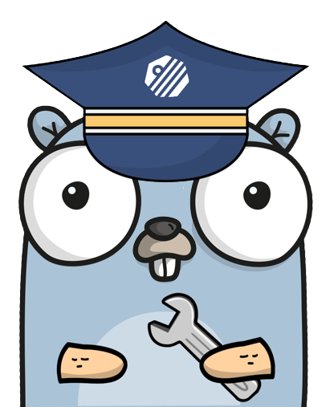

# Keptn go-utils


[](https://goreportcard.com/report/github.com/keptn/go-utils)



This repository contains packages for common functionality around the [Keptn Project](https://github.com/keptn).
Please post any issues to [keptn/keptn repository](https://github.com/keptn/keptn/issues) and label them
with `area:go-utils`.

## Installation

Get the latest version using

```console
go get github.com/keptn/go-utils
```

Also consider browsing our [Releases Page](https://github.com/keptn/go-utils/releases) to find out about all releases.

## Contributing

If you want to contribute, just create a PR on the **master** branch.
Please also see [CONTRIBUTING.md](CONTRIBUTING.md) instructions on how to contribute.

## Creating a Keptn service using `cp-connector`

One way to create a Keptn integration (a.k.a. Keptn service) is to use the `cp-connector` library which abstracts away
the
details of how to interact with the keptn api to register your implementation as an Keptn integration to the control
plane.

[Example](./examples/cp-connector)

## Creating a Keptn service using the `go-sdk` (experimental)

If you want to use more features besides what the `cp-connector` provides, you can use the Keptn `go-sdk` which
basically wraps around `cp-connector` and provides features like automatic sending of `.started/.finished` or error
events.

[Example](./examples/go-sdk)

## Accessing the Keptn API

The recommended way of accessing the Keptn API using `GO` is to use the `APISet`:
You can use it by importing the following package:

```golang
import api "github.com/keptn/go-utils/pkg/api/utils"
```

Then you need to create an `APISet` and provide it the information about
the Keptn API endpoint URL and the auth token:

```go
keptnAPI, err := api.New("https://url-to-my-keptn-cluster/api", api.WithAuthToken(mySecretToken))
if err != nil {
log.Fatal(err)
}
```

Once you have a handle to the `APISet` you can start using it:

```go
resources, err := keptnAPI.ResourcesV1().GetAllServiceResources("my-project", "my-stage", "my-service")
if err != nil {
log.Fatal(err)
}
```

### Accessing the Keptn API from within the control plane

If you are developing an Keptn integration that is supposed to run *inside/as part of* the Keptn control plane,
there is no need to talk to the Keptn API via the API gateway. In this case one option is to use the `InternalAPISet`.

Import the following package:

```go
import api "github.com/keptn/go-utils/pkg/api/utils"
```

Then create an `InternalAPISet`. Note, that this does *not* require you to pass the URL to the keptn API or an API token

```go
keptnAPI, err := api.NewInternal(nil)
if err != nil {
log.Fatal(err)
}
```

## Creating and inspecting Keptn events:

```go
// Creating a new event
newEvent, _ := lib.KeptnEvent(lib.GetStartedEventType("echo-task"), "my-service", lib.EventData{
Project: "my-project",
Stage:   "my-stage",
Service: "my-service",
}).Build()

// Converting KeptnContextExtendedCE to cloudevent sdk event
cloudEvent := lib.ToCloudEvent(newEvent)
fmt.Println(cloudEvent.ID())

// Converting cloudevents sdk event to KeptnContextExtendedCE
newEvent, _ = lib.ToKeptnEvent(cloudEvent)

// Marshalling a keptn event to JSON
newEventAsJSON, _ := newEvent.ToJSON()
fmt.Println(string(newEventAsJSON))

// Creating a started event for a triggered event
startedEventType, _ := lib.ReplaceEventTypeKind(*triggeredEvent.Type, "started")
startedEvent := lib.KeptnEvent(startedEventType, "my-service", triggeredEvent.Data)

startedEventAsJSON, _ := startedEvent.ToJSON()
fmt.Println(string(startedEventAsJSON))

// Checking for event types
fmt.Println(lib.IsSequenceEventType("sh.keptn.event.echo.triggered")) // false
fmt.Println(lib.IsSequenceEventType("sh.keptn.event.stage.echo.triggered")) // true
fmt.Println(lib.IsTaskEventType("sh.keptn.event.echo.triggered")) // true
fmt.Println(lib.IsTaskEventType("sh.keptn.event.stage.echo.triggered")) // false
fmt.Println(lib.IsTriggeredEventType("sh.keptn.event.echo.triggered")) // true
```

## Querying Keptn events

```go
// Creating the APISet
apiSet, _ := api.New("http://<keptn-url>/api", api.WithAuthToken("<api-token>"))

// Getting all events for a specific project
events, _ := apiSet.EventsV1().GetEvents(&api.EventFilter{Project: "echo-project"})

// Getting all event matching a specific keptn context
events, _ = apiSet.EventsV1().GetEvents(&api.EventFilter{KeptnContext: "7d4ca79a-6f38-4b88-9139-433342e350bf",})

// Getting all .triggered events that are "not yet processed" by a keptn integration for a specific project
events, _ = apiSet.ShipyardControlV1().GetOpenTriggeredEvents(api.EventFilter{Project: "echo-project"})
```

## Ingesting Keptn events

When using `cp-connector` or `go-sdk` there is a way pedefined way to get a handle to the event sender for being able
to *send back* events to Keptn (see [examples](./examples/cp-connector)).
Below is an example of how to use the `APISet` directly to send an event to Keptn:

```go
// Creating the APISet
apiSet, _ := api.New("http://<keptn-url>/api", api.WithAuthToken("<api-token>"))

// Create event you want to send
eventToSend, _ := lib.KeptnEvent(lib.GetStartedEventType("echo-task"), "my-service",
	lib.EventData{
	    Project: "my-project", 
		Stage: "my-stage", 
		Service: "my-service",
	}).Build()

// Sending the event to Keptn
eventContext, _ := apiSet.APIV1().SendEvent(eventToSend)
fmt.Println(*eventContext.KeptnContext)
```

## Keptn GO models / structs

The go models for the Keptn the Keptn API can be used by importing: `github.com/keptn/go-utils/pkg/api/models`.

Further, the go models for e.g. the shipyard `yaml` etc. can be used by
importing: `github.com/keptn/go-utils/pkg/lib/v0_2_0`